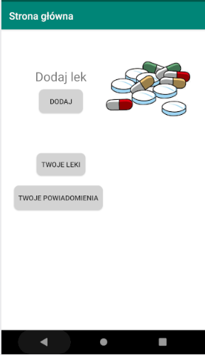
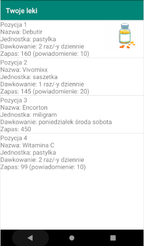
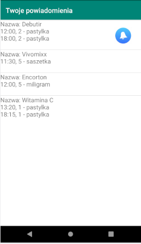
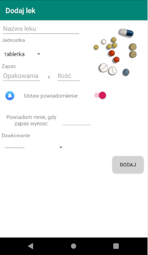
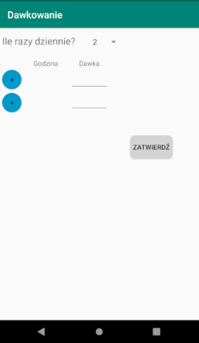
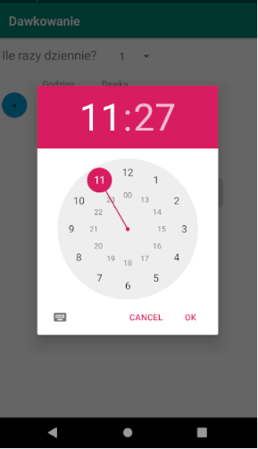
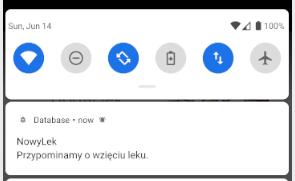
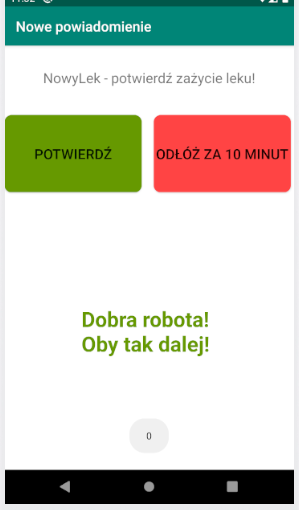
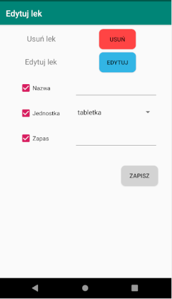
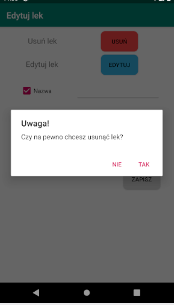

# Aplikacja monitorująca przyjmowanie leków oraz witamin

Aplikacja zaliczeniowa na przedmiot Aplikacje Mobilne, Politechnika Wrocławska - kierunek: Automatyka i Robotyka.

## Opis działania aplikacji
Aplikacja pozwala na wprowadzenie aktualnie przyjmowanych leków orazustawienie dawki i godziny ich przyjmowania. Umożliwia także generowanie po-wiadomień, które mają przypominać o zażyciu lekarstwa. Użytkownik może zaakceptować powiadomienie od razu lub odłożyć je na później - wtedy pojawi sięono ponownie np. po 10 minutach. Możliwe jest wprowadzenie zapasów 
leków do bazy - wtedy aplikacja wygeneruje powiadomienie, gdy lek zacznie się kończyć. Dodatkowo aplikacja generuje prostą animację, która potwierdza zażycie leku.

## Zrealizowane zadania ##
- [x] Połączenie z bazą danych - dodawanie leku
- [x] Wyświetlanie informacji o lekach w bazie
- [x] Edycja podstawowych informacji o lekach oraz usuwanie leków 
- [ ] Edycja powiadomień - w budowie
- [x] Generowanie powiadomień dla opcji dawkowania X razy dziennie
- [ ] Generowanie powiadomien dla opcji dawkowania X razy w tygodniu - w budowie
- [x] Aktualizacja bazy po potwierdzeniu przyjęcia leku
- [x] Generwoanie powiadomień o kończącym się zapasie
- [x] Dodanie grafiki, wizualne poprawki layoutu
- [x] Dodanie layoutu poziomego, dodanie layoutów dla dużych ekranów

## Użyte technologie
- Firebase - baza danych
- Animacje - daimajia.anroidanimations

## Strona główna
  

## Wyświetlanie leków
  

## Wyświetlanie powiadomień
  

## Dodawanie leku
  

## Dawkowanie leku - X razy dziennie
  
  

## Powiadomienie - godzina przyjmowania leku
  
  

## Edycja leku
  

## Usuwanie leku
  
